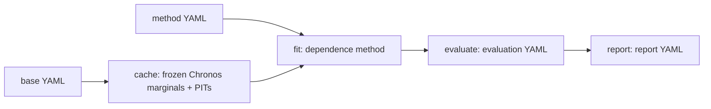

# Usage guide

This guide covers how to install Simcast, obtain data, build frozen marginals,
fit dependence methods, evaluate them, and report the comparison. Field-level
details are in the [configuration reference](configuration_reference.md), file
schemas in the [artifact reference](artifact_reference.md), and the reasoning
behind each step in the scientific chapters, starting with the
[research problem](../scientific/01_research_problem.md).

Contents:

1. [Choose the appropriate interface](#1-choose-the-appropriate-interface)
2. [Configuration documents](#2-configuration-documents)
3. [Environment and data](#3-environment-and-data)
4. [Frozen-marginal construction](#4-frozen-marginal-construction)
5. [Singular experiment](#5-singular-experiment)
6. [Composite experiment](#6-composite-experiment)
7. [Evaluating fits](#7-evaluating-fits)
8. [Reporting](#8-reporting)
9. [Venues, identifiers, and resume](#9-venues-identifiers-and-resume)
10. [Outputs and interpretation](#10-outputs-and-interpretation)
11. [Notebooks](#11-notebooks)
12. [Advanced configuration and temporary overrides](#12-advanced-configuration-and-temporary-overrides)
13. [Common situations](#13-common-situations)
14. [Validation without experiments](#14-validation-without-experiments)

## 1. Choose the appropriate interface

The workflow has three stages: **fit**, **evaluate**, and **report**. Each
stage reads only the output of the stage before it, so an evaluation can be
repeated without refitting and a report can be regenerated without
re-evaluating.



| Objective | Command | Main input | Main output |
|---|---|---|---|
| Download the data needed by one base | `uv run download-data` | base YAML | files under `data/liander2024/` |
| Build frozen Chronos marginals and PITs only | `uv run cache` | base YAML | `artifacts/cache/<base-id>-<fingerprint>/` |
| Fit and evaluate one method quickly | `uv run singular` | base and method YAML | `runs/singular/<timestamp>_<base>_<method>/` |
| Fit a declared study (and run its declared evaluations) | `uv run composite` | composite YAML | `runs/<venue>/<composite>/<run-id>/` |
| Evaluate existing fits under an evaluation design | `uv run evaluate` | composite or evaluation YAML | `<run-root>/evaluations/<evaluation-id>/` |
| Compare evaluated methods against a reference | `uv run report` | composite or report YAML | `<run-root>/reports/<report-id>/<evaluation-id>/` |
| Inspect data, marginals, PITs, or one method interactively | notebooks | base and method YAML | explanatory calculations and figures |

Every command prints its options with `--help`. A typical study is:

```bash
uv run composite --config configs/venues/lab/quick_all_methods.yaml
uv run evaluate  --composite-config configs/venues/lab/quick_all_methods.yaml
uv run report    --config configs/reports/lab_main.yaml \
  --run-root runs/lab/quick_all_methods/<run-id>
```

`composite` already runs the evaluations declared in its YAML, so the
`evaluate` line only computes evaluation cells that are still missing.

## 2. Configuration documents

Every YAML document declares its `kind`. The five kinds separate what is held
fixed from what is varied and from how results are scored and compared.

| Kind | Declares | Typical location |
|---|---|---|
| `base` | data, complete entity group $\mathcal E_g$, information set $\mathcal I^{(i)}$, forecast origins, Chronos-2, and PIT construction | `configs/bases/liander2024/` |
| `method` | one dependence hypothesis M0--M4 and only its own parameters | `configs/methods/` |
| `composite` | which bases, method variants, and seeds to fit, plus optional evaluation and report entries | `configs/venues/<venue>/` |
| `evaluation` | sampling, metrics, cross-entity statistic, quantile and interval levels, and figures | `configs/evaluations/` |
| `report` | reference method, presented metrics, and moving-block bootstrap settings | `configs/reports/` |

A method cannot change marginal quantiles, an evaluation cannot change a fit,
and a report cannot add a metric that was not evaluated. M0 has no features or
optimization, M1 has only its static covariance estimator, and M2--M4 each
have features, a model parameterization, and an optimization design. Unknown
fields and fields belonging to another method are validation errors.

The reasons for holding the base fixed are developed in
[Chapter 1](../scientific/01_research_problem.md) and
[Chapter 6](../scientific/06_scientific_workflow.md).

## 3. Environment and data

Create the locked environment and install the pinned, patched Chronos source
from the repository root:

```bash
uv sync --group dev
bash scripts/setup_chronos.sh
```

The patch only exposes the output-patch representation used as a conditioning
feature; it does not change forecast quantiles.

Chronos weights are retrieved through the Hugging Face cache. Public
retrieval works without authentication but is rate-limited; optionally set a
token:

```bash
export HF_TOKEN=...
```

The dataset defaults to `data/liander2024`. Two environment variables change
local behaviour without changing any scientific result:

```bash
export SIMCAST_DATA_DIR=/absolute/path/to/liander2024
export SIMCAST_DEVICE=cuda
```

Download only the files required by one base:

```bash
uv run download-data --base configs/bases/liander2024/transformer.yaml
```

Choosing a different base selects a different group: the transformer base has
$K_g=15$, the solar and wind bases $K_g=5$. The solar base also declares
isotonic quantile repair.

## 4. Frozen-marginal construction

Build the Chronos native quantile grids, output-patch representations, and
finite-quantile PIT observations for one base without fitting any dependence
method:

```bash
uv run cache --base configs/bases/liander2024/transformer.yaml
```

The cache location is derived from the base's marginal fingerprint (see
[cache compatibility](#cache-compatibility)). `singular` and `composite` build
a missing cache automatically, so this command is only needed to prepare or
inspect marginals in advance. Options:

- `--output-dir <dir>` writes to an explicit directory.
- `--overwrite` replaces an existing cache; without it an existing cache is
  never touched.
- `--set key=value` applies a temporary override (§12).

Before changing a PIT option, read
[Chapter 3](../scientific/03_chronos_and_pit.md): the cache stores the
configured finite-quantile law, which may be discretized or piecewise linear.

### Cache compatibility

Let $b$ be a resolved base. Its fingerprint is the SHA-256 digest

$$
h(b)=h(\mathcal E_g,\text{data revision},\text{forecast protocol},
\mathcal I,\text{split},\text{Chronos revision},\text{PIT construction}).
$$

The default cache directory contains the first 12 hexadecimal characters of
$h(b)$, but the name is only a convenience. Before reuse, stored metadata are
normalized and hashed again: a uniquely compatible directory is reused even if
renamed, a plausible name with incompatible metadata is rejected, and several
compatible candidates are treated as ambiguous.

Methods, venues, evaluations, and reports do not enter $h(b)$, so changing
them never rebuilds Chronos. Local data location, device, and Chronos batch
size are operational and are excluded as well. Changing the ordered entity
IDs, weather source, split, horizon, Chronos revision, or any `pit.*` field
selects a different cache.

Implementation: `base_fingerprint` and `locate_compatible_cache`.

## 5. Singular experiment

A singular experiment fits and evaluates one method on one base. It is the
quickest way to study a single hypothesis:

```bash
uv run singular \
  --base configs/bases/liander2024/transformer.yaml \
  --method configs/methods/m4_conditional_kernel.yaml
```

The command locates or builds the compatible cache, fits only the selected
method, and evaluates it with the default evaluation design (§7). M4 consumes
every valid complete training vector; there is no method-specific origin limit
or implicit epoch reduction.

Add a reference method of a different family to evaluate both on identical
test cases, marginal grids, and case-keyed Gaussian draws (common random
numbers):

```bash
uv run singular \
  --base configs/bases/liander2024/transformer.yaml \
  --method configs/methods/m4_conditional_kernel.yaml \
  --reference-method configs/methods/m0_independent.yaml
```

Common random numbers reduce Monte Carlo noise in the score difference; they
do not remove parameter-estimation uncertainty. A singular run fits each
method once, with the seed from its method file, and writes no bootstrap
report; use a composite for declared repetitions.

Other options: `--output-dir` chooses the run directory (default
`runs/singular/<UTC-timestamp>_<base-id>_<method-id>/`, which must not exist)
and `--rebuild-cache` rebuilds the compatible cache first.

The M4 hypothesis is derived in
[Chapter 4](../scientific/04_dependence_models.md); likelihood, projection, and
scores are defined in [Chapter 5](../scientific/05_training_sampling_scoring.md).

## 6. Composite experiment

A composite is an explicit list of fits, not an implicit parameter grid.
`bases` and `methods` are required; `evaluations` and `reports` are optional,
and reports require at least one evaluation:

```yaml
kind: composite
name: main              # optional; defaults to the file name
venue: example          # must match configs/venues/<venue>/

bases:
  - id: transformer
    config: ../../bases/liander2024/transformer.yaml

methods:
  - id: m0
    method: ../../methods/m0_independent.yaml
  - id: m4
    method: ../../methods/m4_conditional_kernel.yaml
    seeds: [11, 23, 37]

evaluations:
  - id: standard
    config: ../../evaluations/standard.yaml

reports:
  - id: main
    config: ../../reports/lab_main.yaml
    evaluation_ids: [standard]
```

Run it with:

```bash
uv run composite --config configs/venues/<venue>/main.yaml
```

Each method entry is fitted on every listed base unless it names `base_ids`.
Deterministic M0/M1 entries give one fit per base; conditional M2--M4 entries
give one fit per base and seed. With five bases, M0 gives five fits and an M4
entry with ten seeds gives fifty. Identical deterministic fits are shared.

After fitting, `composite` runs every declared evaluation on the fits it
selects (all fits when `base_ids`/`method_ids` are omitted). It never writes a
report, even when `reports` is declared: reporting is always the explicit
`report` step (§8). Without `evaluations`, the command only fits.

Options: `--run-id` sets a stable run identifier, `--resume` continues an
interrupted run (§9), and `--rebuild-cache` rebuilds compatible caches first.

Repeated method entries with distinct IDs express ablations and sensitivity
variants. Overrides are validated against the referenced method family, so
`model.latent_rank` is valid for M2/M3 and invalid for M4.

Treat a composite as the execution of a predeclared comparison.
[Chapter 6](../scientific/06_scientific_workflow.md) explains the resulting
evidence chain and [Chapter 7](../scientific/07_experiments_and_results.md)
specifies which comparisons are scientifically interpretable.

### Laboratory budgets

Preliminary computation is declared as a composite-level override:

```yaml
- id: m4_quick
  method: ../../methods/m4_conditional_kernel.yaml
  overrides:
    optimization:
      epochs: 2
      patience: 1
```

The same override is valid for M2 and M3. It states that the *experiment* uses
a reduced budget; it does not define a special method.
`configs/venues/lab/quick_all_methods.yaml` applies the same reduced budget to
all three gradient-fitted methods. Such results are preliminary by design.

## 7. Evaluating fits

Fitting never depends on sampling or scoring, so the same fits can be
evaluated under several designs. An evaluation document declares one design:

```yaml
kind: evaluation
id: standard                     # optional; defaults to the file name
metrics: [mean_pinball, crps, weighted_interval_score,
          energy_score, variogram_score, test_pseudo_nll]
sampling:
  num_samples: 4096
  evaluation_seed: 2027
evaluation:
  cross_entity_statistic: sum    # sum | absolute_sum | max | absolute_max
  quantile_levels: [0.05, 0.10, 0.25, 0.50, 0.75, 0.90, 0.95]
  interval_levels: [0.50, 0.80, 0.90]
figures:
  correlation_lead: 1
```

- `metrics` is the exact list of canonical metrics computed and persisted.
  `mean_pinball` also retains `pinball_q*`; `weighted_interval_score` retains
  coverage, width, and interval-score diagnostics. The report may select only
  metrics declared by every evaluation cell it includes.
- `cross_entity_statistic` selects the scalar $T(\mathbf y)$ that aggregate
  scores evaluate: $\sum_k y_k$, $\sum_k|y_k|$, $\max_k y_k$, or
  $\max_k|y_k|$. It is applied identically to every scenario and to the
  observation.
- `quantile_levels` are the aggregate quantiles scored by pinball loss.
  `interval_levels` are central interval coverages; level $c$ uses the
  empirical $(1-c)/2$ and $(1+c)/2$ scenario quantiles, independently of
  `quantile_levels`.
- `figures` selects the origin shown in the scenario fan and correlation
  figures and the correlation lead (defaults: first test origin, lead 1).

Every field is listed in the
[configuration reference](configuration_reference.md#7-evaluation-and-report-configuration).
A singular run always uses the defaults shown above.

### Running an evaluation

`evaluate` has two mutually exclusive modes.

**Composite mode** runs the evaluation entries declared in a composite:

```bash
uv run evaluate --composite-config configs/venues/lab/quick_shot.yaml
uv run evaluate --composite-config configs/venues/lab/quick_shot.yaml \
  --evaluation-id standard --run-id 2026-09-24_133838
```

Without `--evaluation-id`, every declared entry runs. The run is found under
`runs/<venue>/<composite>/`; `--run-id` is required only when that directory
holds more than one run.

**Standalone mode** applies an evaluation document to any completed run,
without editing the composite:

```bash
uv run evaluate --config configs/evaluations/variogram_power_1.yaml \
  --run-root runs/lab/quick_shot/2026-09-16_093812
```

The document's optional `base_ids` and `method_ids` restrict the evaluated
fits; empty lists select all fits in the run.

In both modes the command is idempotent: cells with a completed
`evaluation_manifest.json` are skipped and only missing cells are computed.
`--force` discards and recomputes the selected cells. Output is written to
`<run-root>/evaluations/<evaluation-id>/` and recorded in the run manifest,
so it is immediately reportable. Progress is logged per cell.

## 8. Reporting

A report reads completed evaluation records only. It never calls Chronos, a
fitter, or the evaluator, so it is cheap to regenerate while choosing metrics
or bootstrap settings. A report document declares:

```yaml
kind: report
reference: m0                    # method ID used for paired effects
metrics: [mean_pinball, crps]    # optional; default: every evaluated metric
evaluation_ids: [standard]       # optional; default: every evaluation in the run
analysis:
  bootstrap_replicates: 10000
  primary_block_length: 7
  sensitivity_block_lengths: [3, 14]
```

`report` has the same two modes as `evaluate`.

**Composite mode** runs the report entries declared in a composite, each
restricted to its own `evaluation_ids`:

```bash
uv run report --composite-config configs/venues/<venue>/study.yaml
uv run report --composite-config configs/venues/<venue>/study.yaml --report-id main
```

**Standalone mode** applies a report document to any completed run:

```bash
uv run report --config configs/reports/powertech2027_main.yaml \
  --run-root runs/powertech2027/main/<run-id>
```

Each selected evaluation gets its own directory,
`<run-root>/reports/<report-id>/<evaluation-id>/`. The report ID is the
composite entry ID, or the report file name in standalone mode. Further
options:

- `--evaluation-id <id>` reports only one evaluation.
- `--output-dir <dir>` writes to `<dir>/<evaluation-id>/` instead
  (`<dir>/<report-id>/<evaluation-id>/` when several composite reports run).
- `--run-id` selects a run in composite mode, as for `evaluate`.
- `--force` removes the selected report directory before regeneration.

Requesting a metric that the selected evaluations did not declare is an
error. Seeds are averaged within method and origin before the moving-block
bootstrap, because a seed repeats parameter estimation rather than adding a
forecast instance.

## 9. Venues, identifiers, and resume

A venue is a named, cloneable research workspace, not a Python environment. A
composite must live below `configs/venues/<venue>/` and its `venue` field must
match that directory. Venue, composite, and run identifiers are lowercase safe
slugs. Every artifact of a run nests under one root:

```text
runs/<venue>/<composite>/<run-id>/
  models/<base-id>/<method-id>/<seed-label>/
  evaluations/<evaluation-id>/<base-id>/figures/
  evaluations/<evaluation-id>/<base-id>/<method-id>/<seed-label>/
  reports/<report-id>/<evaluation-id>/
```

`<seed-label>` is `deterministic` for M0/M1 and `seed_<N>` for conditional
fits. Without `--run-id`, a UTC timestamp is used. Fix the identifier for a
long run:

```bash
uv run composite --config configs/venues/<venue>/main.yaml --run-id replication_01
```

After an interruption, repeat the command with `--resume`. Resume recomputes
the fully resolved composite hash and rejects a mismatch before fitting.
Validated complete fits are skipped, missing fits continue, and partial or
incompatible directories are never overwritten. A changed composite needs a
new run identifier.

## 10. Outputs and interpretation

The exact contents of every file are defined in the
[artifact reference](artifact_reference.md). In short:

- **Fit directory** (`models/...`): resolved configuration, run metadata, the
  fitted model (`model.npz` for M0/M1, `best.pt`/`final.pt` for M2--M4), and
  training curves for M2--M4.
- **Evaluation directory** (`evaluations/<evaluation-id>/<base>/<method>/<seed>/`):
  `metrics.json`, `metrics_by_lead.csv`, per-case and per-origin parquet
  tables, aggregate predictions, `evaluation_manifest.json`, and method
  figures (scenario fan, correlation, dependence diagnostics, and
  `summary_by_lead_<metric>.png` per declared metric). Base-level dataset,
  marginal, and static-correlation figures are written once to
  `evaluations/<evaluation-id>/<base>/figures/`.
- **Report directory** (`reports/<report-id>/<evaluation-id>/`):
  `per_origin_metrics.parquet`, `method_summary.csv`, `paired_effects.csv`,
  `method_comparison_<metric>.png`, `paired_effect_<metric>.png`,
  `summary_coverage.png` and `summary_quantile_calibration.png` (one panel per
  base), and
  `report_summary.md`, which describes every file present.
- **Singular directory**: resolved base and method(s),
  `singular_manifest.json`, `methods/<method-id>/`, `evaluation/`, and
  base-level `figures/`.

### Progress and logs

Long-running commands report phase starts and completions through standard
logging. Composite runs also retain these messages in `composite.log`.
Interactive terminals show `tqdm` progress bars for cache origins, evaluation
batches, composite fit cells, and each M2--M4 training epoch; epoch bars show
the current training and validation pseudo-NLL. Progress bars are transient and
are not written to logs.

### Reading a completed report

1. Confirm the base fingerprint, ordered entity IDs, $K_g$, complete-case
   mask, and marginal diagnostics. These define the common forecast
   experiment.
2. For M2--M4, check each seed's fitting curve and validation pseudo-NLL
   before looking at test scores.
3. Read `method_summary.csv` together with `paired_effects.csv`. All scores
   are negatively oriented: a negative paired difference against the
   reference favours the method, and `paired_effect_<metric>.png` shows it as
   a positive relative improvement. Judge effects by their moving-block
   intervals, not by point estimates.
4. Use `summary_by_lead_<metric>.png` and `metrics_by_lead.csv` to check
   whether an overall result hides horizon heterogeneity; use coverage and
   quantile-calibration figures together with interval scores.
5. Use correlation and scenario figures to explain behaviour, not to select a
   method after the fact. Keep declared sensitivities separate from the
   principal comparison.

`summary_coverage.png` and `summary_quantile_calibration.png` pool valid
origin-lead cases and fitted seeds within each base/method. They show empirical
hit rates against nominal interval or quantile levels, without uncertainty
bands. They diagnose calibration, not sharpness or total score: read them
alongside interval widths and the proper scores. See
[Chapter 5](../scientific/05_training_sampling_scoring.md#calibration-summaries)
for formulas and interpretation.

A comparison is valid only when the base fingerprint and complete entity
ordering coincide. [Chapter 7](../scientific/07_experiments_and_results.md)
states what must accompany a scientific claim.

## 11. Notebooks

Register the project kernel once, then start Jupyter through the project
environment:

```bash
uv run python -m ipykernel install --user --name simcast --display-name "Python (simcast)"
uv run jupyter lab
```

Select the `Python (simcast)` kernel. The [notebook guide](../../notebooks/README.md)
describes the reading order. The workflow notebooks and method monographs
call the same functions as the CLI and keep write-producing cells disabled by
default. Notebook 02 takes one `BASE_FILE`, builds that cache when absent, and
reports when the selected cache contains no quantile crossings rather than
loading another group. `notebooks/reporting/01_report_walkthrough.ipynb`
displays an existing report directory.

## 12. Advanced configuration and temporary overrides

Most work only needs the supplied YAML files. Three mechanisms help when
writing new files or making a one-off change.

### Inheriting a common configuration

`extends` names one or more parent YAML files. The child starts from the
parents and replaces only the fields it states:

```yaml
extends: common.yaml
kind: base
id: liander2024_transformer
data:
  entity_type: transformer
```

Relative parent paths are resolved from the child file, several parents are
applied in order, nested mappings merge by field, and lists such as
`ordered_entity_ids` are replaced whole. Composites can extend a shared file
too, as `configs/venues/powertech2027/main.yaml` does.

### Reading a local value from the environment

```yaml
local_dir: ${SIMCAST_DATA_DIR:-data/liander2024}
```

This uses `SIMCAST_DATA_DIR` when set and `data/liander2024` otherwise, so the
data location changes without editing the base.

### Temporary command-line overrides

`cache` and `download-data` accept `--set key=value`, which changes one nested
base value for that command only. The key follows the YAML nesting with dots
and the value is parsed as YAML:

```bash
uv run cache --base configs/bases/liander2024/transformer.yaml \
  --set pit.dependence_transform=training_frequency
```

is equivalent to:

```yaml
pit:
  dependence_transform: training_frequency
```

Further examples:

```bash
--set chronos.device=cpu
--set pit.mode=linear_interpolation
--set covariates.future_weather_source=oracle
```

`pit.mode=linear_interpolation` changes both historical PITs and scenario
projection, hence the fingerprint and cache. It cannot be combined with
`pit.dependence_transform=training_frequency`, which is defined only for
discretized cells. See
[Chapter 3](../scientific/03_chronos_and_pit.md#4-two-finite-quantile-pit-constructions)
and the [PIT fields](configuration_reference.md#25-finite-quantile-marginal-law-and-pit).

Method and base changes inside a study are declared as `overrides` on
composite entries (§6), so they are recorded in the resolved composite.

## 13. Common situations

| Situation | Action |
|---|---|
| `ModuleNotFoundError: simcast` in Jupyter | select or install the `Python (simcast)` kernel and start Jupyter with `uv run jupyter lab` |
| Dataset file missing | set `SIMCAST_DATA_DIR` or run `uv run download-data` for the base |
| Cache file or `.zmetadata` missing | the cache is absent or incomplete; rebuild it, using `--overwrite` only for a deliberate replacement |
| Hugging Face unauthenticated warning | public retrieval is rate-limited; optionally set `HF_TOKEN` |
| No crossing figure in notebook 02 | the selected cache has no representative crossing; this is a valid result |
| `evaluate`/`report` reports several runs | pass `--run-id`, or use `--config` with `--run-root` |
| Report rejects a metric | add it to the evaluation's `metrics` and run `evaluate --force`, or drop it from the report |
| Evaluation or report must reflect a changed config | run it again with `--force` |
| Configuration rejected | check the [configuration reference](configuration_reference.md); unknown and cross-method fields are invalid |

## 14. Validation without experiments

```bash
uv run ruff check src tests
uv run mypy src
uv run pytest
```

These checks cover schemas, matrix properties, complete-vector invalidation,
permutation equivariance, finite PIT and projection laws, cache identity,
expansion, resume, evaluation, and reporting on synthetic temporary data. They
do not run Chronos, fit the empirical experiments, or alter `runs/`.
